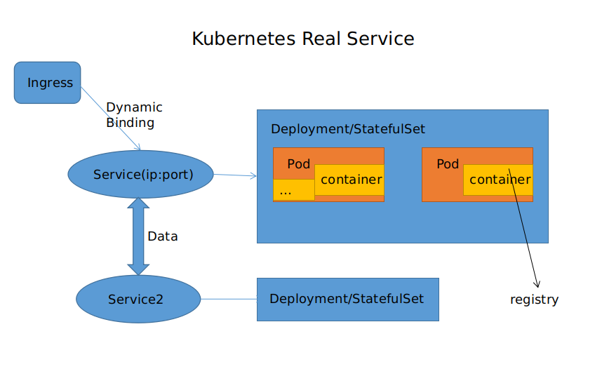

## kubernetes 多机器/分布式/初步使用体验
> k8s来源于最初学习golang接触的项目, 目前已经是一个61k star的超级项目

- [安装](https://github.com/dreamlu/shell/tree/master/docker/k8s/install)(方式选择其一)  
1.kubeadm(刚学建议折腾,有助理解)  
2.minikube(本地开发)  
3.rancher(界面化操作,上述命令行)  

- 常见使用  
1.运行: `kubectl apply -f .(kubectl apply -f xx.yaml)`  
2.查看[包含ip]: `kubectl get pods -o wide`  
3.问题定位: `kubectl describe pods xx` | `kubectl logs pods xx`  

> #### k8s 部署实战经历  
> [spring cloud原生结合kubernetes](https://github.com/dreamlu/shell/tree/master/docker/k8s/spring-cloud), 或者参考: [go版](https://github.com/dreamlu/shell/tree/master/docker/k8s/go)  

### k8s概念解析  
k8s提供的是一种通用的分布式解决方案, 是可移植的、跨平台的、可扩展的开源平台

- 为什么用它?  
1.容器部署的时代,摒弃环境等差异,轻量级别  
2.服务发现和负载均衡  
3.容器编排  
4.发布和回滚  
5.自我修复  
6.加密等...  
---

  

上图(来源网络): 由一个`master`节点和三个`node`节点组成, 可通过UI界面或CLI命令行进行管理,这是一个多个节点关联的图解, 针对机器而言  

  

这是一个真实业务图解, 针对应用而言  

+ 一般而言, 一个Service对应一个Deployment  
+ Service顾名思义, 用作服务, 处理请求,包含了ip端口等  
+ Deployment/StatefulSet是容器编排, 管理容器的各种配置, 如常见的同一个容器的数量节点, cpu/内存, 亲和性节点等  
+ Service之间通过k8s内部网络进行服务名与ip的动态解析进行通讯  
+ Ingress(对外暴露服务)用来动态解析域名关联到Service ip, ps: k8s中各种资源重新生成时, ip会变,(相比其他方式暴露,最为常见和安全)  

> 结合云时代, 在分布式操作中, k8s几乎不用考虑硬件, 拥有这分布式极为完善的功能  
> 资源管理, 内存/cpu, 权限, 网络处理, dns解析, 

ps: spring cloud 由于对k8s支持不友好(实现方式如上链接), 现在有的spring cloud kubernetes项目, 感兴趣的可以试试  
-- update: 2019-01-17  
ps2: 目前为了兼容go版服务, 通过consul替代eureka很好的实现了 `跨语言`的微服务体系结构
