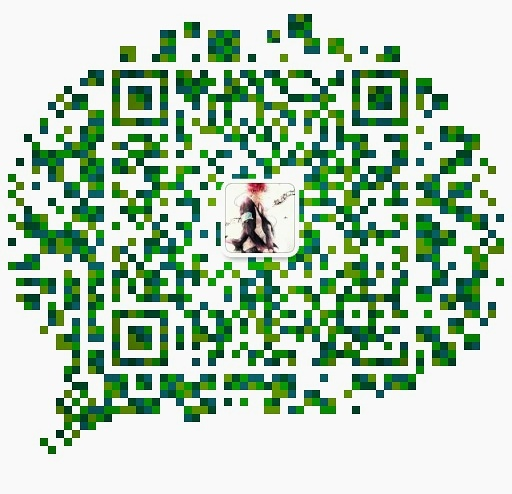

## 欢迎了解我
---
#### 我的理念
> 任何一种语言不过达成目标的途径罢了：<i>if need, study</i>

#### 我的经历

1.大一拥有自己的电脑～啦啦啦～开始接触C语言，下班学期学习Java,并开始对编程产生了极大的兴趣

2.Jsp/C++/h5+js+css/Android/Python/Sql Server/mysql等等的接触了解学习，第一次写的web([志愿者网站](https://github.com/Dreamlu/volunteer)),还有一个简单的Android的美食app(源码已经没了......)，期间还了解过一些java的web框架SSM，拥有了自己的第一台云服务器,学期结束期间还写过个[通用后台系统](https://github.com/Dreamlu/common-system)

3.大三，C#/Linux/JAVA EE方向的学习，不过我们学的还是蛮古老的SSH;期间利用h5+ajax+java为某个政府部门写了个[请销假系统](https://github.com/Dreamlu/askforleave)

4.大三下半学期，即我现在的阶段，Android/Asp.net课程，接触过微信小程序/NodeJs，学习go web中，未来主要发展后端方向( Any language is my tool)

#### 联系我
微信：a_862362681 
QQ：862362681 
email:862362681@qq.com 
&nbsp;&nbsp;&nbsp;&nbsp;&nbsp;&nbsp;&nbsp;&nbsp;

#### This is me!(emm...)

